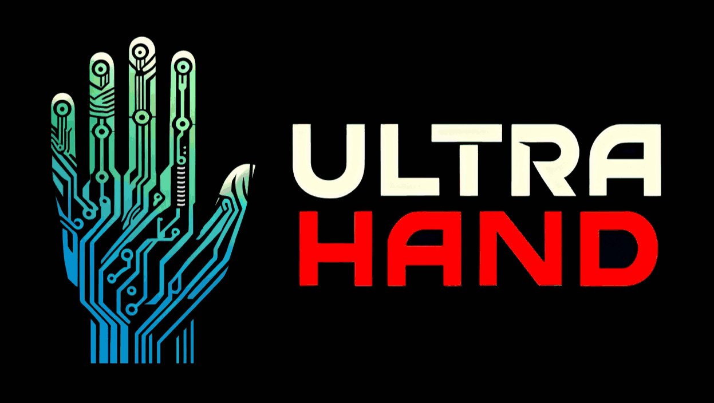

# Ultrahand Overlay (HOS 16.0.0+)

Create directories, manage files, and customize configurations effortlessly using simple ini files.

Ultrahand Overlay is a [Tesla Menu](https://github.com/WerWolv/Tesla-Menu) replacement built from the ground up off of [libtesla](https://github.com/WerWolv/libtesla) that provides powerful C/C++ commands through the usage of its own [custom interpretive programming language](https://github.com/ppkantorski/Ultrahand-Overlay/wiki/Command-Reference) (similar to Shell/BASH).  It is a versatile tool that enables you to create and share custom command-based packages, providing enhanced functionality for managing settings, files and directories on your Nintendo Switch.

With Ultrahand, you have the flexibility to customize and shape your file management system according to your needs, empowering you with greater control over your system configurations.

## Screenshots

## Features

Ultrahand Overlay currently offers the following features:

- Create Directories:
  - Effortlessly create directories on your SD card by specifying the directory path. Ultrahand will handle the creation process for you.

- Copy Files or Directories:
  - Easily copy files or directories from one location to another on your SD card. Just provide the source and destination paths, and Ultrahand will seamlessly handle the copying process.

- Delete Files or Directories:
  - Simplify file and directory deletion on your SD card. By specifying the path of the file or directory you want to delete, Ultrahand promptly removes it, making the deletion process hassle-free.

- Move Files or Directories:
  - Seamlessly move files or directories between locations on your SD card. Provide the source path and the destination directory path, and Ultrahand takes care of the moving process, ensuring smooth relocation.

- Download Files:
  - Download files to your SD card with ease. Efficiently retrieve files from repositories or URLs to your desired location. Whether you need to download/update homebrew or transfer files between locations, this feature simplifies the process, making repository management a breeze.

- Unzip Files:
  - Extract compressed zip files on your SD card by unzipping archived files, preserving their original structure. Whether you have downloaded zip archives or received compressed files, this command simplifies the process of extracting them, making it effortless to access the contents within.

- Modify INI Files:
  - Edit INI files on your SD card with ease. Take full control over your configurations by updating existing key-value pairs, adding new entries, or creating new sections within the INI file using Ultrahand.

- Hex Edit Files:
  - Perform hexadecimal editing of files on your SD card. Edit the binary data directly, allowing for precise control over your data. Ultrahand's Hex Edit Files feature enables you to analyze, modify, and customize files in their raw form.

- Convert Mods:
  - Convert `pchtxt` mods into `ips` or `cheats` format.

- System Commands:
  - There are a variety of system commands that users can utilize.  These include functions to shutdown, reboot, reboot directly into Hekate entries/modes, manipulate the screen's backlight, and turn off all bluetooth controllers.

- Run Commmands On Boot:
  - Users can also utilize their own `/switch/.packages/boot_package.ini` file (with a command section `boot`) to run a series of commands once upon device boot-up.

## Getting Started

### Usage

To use Ultrahand, follow these steps:

1. Download and install the latest [nxovloader](https://github.com/ppkantorski/nx-ovlloader).
2. Download the latest Ultrahand [ovlmenu.ovl](https://github.com/ppkantorski/Ultrahand-Overlay/releases/latest/download/ovlmenu.ovl) and place it within `/switch/.overlays/`.
    - WARNING: This will overwrite `Tesla Menu` if already installed.
3. After installing Ultrahand Overlay, a new folder named `ultrahand` will be created within the root config folder on your SD card (`/config/ultrahand/`) along with a `config.ini` file containing various Ultrahand settings.
4. Launch Ultrahand (similarly to `Tesla Menu`) with Tesla's default hotkeys or Ultrahand's (`ZL+ZR+DDOWN`).  A new folder will be made (`/switch/.packages/`) with a preset `package.ini` file for your base menu commands.

5. Place your custom `package.ini` package file in your Ultrahand package directory (`/switch/.packages/<PACKAGE_NAME>/`). This file will contains the commands for your custom Ultrahand package.
    - See [Ultrahand Packages](https://github.com/ppkantorski/Ultrahand-Packages) for a comprehensive list of known packages.
6. Your commands will now show up on the packages menu within Ultrahand.

## Additional Features
- You can click `A` to execute any command as well as click `MINUS` to view/execute the individual command lines written in the ini for execution.
- You can click `PLUS` on the main menu to enter the settings menu.
- You can click `X` on top of an overlay/package to star them.
- You can click `Y` on top of an overlay/package to configure additional settings.

For additional assistance with custom packages, feel free to checkout the [Ultrahand Overlay Wiki](https://github.com/ppkantorski/Ultrahand-Overlay/wiki).

### Nintendo Switch Compatibility
To run Ultrahand Overlay on the Nintendo Switch, you need to have the necessary [homebrew environment](https://github.com/Atmosphere-NX/Atmosphere) set up on your console running HOS 16.0.0+. Once you have the homebrew environment set up, you can transfer the compiled .ovl to your Switch and launch it using your old `Tesla Menu` hotkeys.

Please note that running homebrew software on your Nintendo Switch may void your warranty and can carry certain risks. Ensure that you understand the implications and follow the appropriate guidelines and precautions when using homebrew software.

### Compilation Prerequisites

To compile and run the software, you need to have the following C/C++ dependencies installed:

- [libultrahand](https://github.com/ppkantorski/libultrahand)
- libnx
- switch-curl
- switch-zziplib
- switch-mbedtls
- switch-jansson

## Contributing

Contributions are welcome! If you have any ideas, suggestions, or bug reports, please raise an [issue](https://github.com/ppkantorski/Ultrahand-Overlay/issues/new/choose), submit a [pull request](https://github.com/ppkantorski/Ultrahand-Overlay/compare) or reach out to me directly on [GBATemp](https://gbatemp.net/threads/ultrahand-overlay-the-fully-craft-able-overlay-executor.633560/).

## License

This project is licensed and distributed under [GPLv2](LICENSE) with a [custom library](https://github.com/ppkantorski/libultrahand/tree/main/libultra) utilizing [CC-BY-4.0](SUB_LICENSE).

Copyright (c) 2024 ppkantorski
