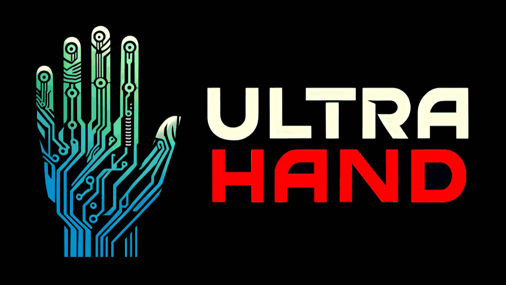

# Ultrahand Overlay (HOS 16.0.0+)

[](https://gbatemp.net/forums/nintendo-switch.283/?prefix_id=44)
[](https://github.com/topics/cpp)
[](https://www.gnu.org/licenses/old-licenses/gpl-2.0.en.html)
[](https://github.com/ppkantorski/Ultrahand-Overlay/releases/latest)
[](https://somsubhra.github.io/github-release-stats/?username=ppkantorski&repository=Ultrahand-Overlay&page=1&per_page=300)
[](https://hb-app.store/switch/UltrahandOverlay)
[](https://github.com/ppkantorski/Ultrahand-Overlay/issues)
[](https://github.com/ppkantorski/Ultrahand-Overlay/stargazers)

**Ultrahand Overlay** is a fully scriptable overlay menu ecosystem for the Nintendo Switch. Accessible instantly via hotkey from any game or application, it provides a powerful custom command language for managing files, configurations, and system settings.

[](https://gbatemp.net/threads/ultrahand-overlay-the-fully-craft-able-overlay-executor.633560/)

Built on [libultrahand](https://github.com/ppkantorski/libultrahand) (an expanded fork of [libtesla](https://github.com/WerWolv/libtesla)), Ultrahand is a full drop-in replacement for Tesla Menu. Every existing Tesla overlay (`.ovl`) works without modification.

---

## Screenshots


---

## Features

### For Users
- Instantly accessible from any game via hotkey or swipe gesture — no game suspension required
- Launch and manage other overlays with per-overlay key combos
- Install and run community packages from [Ultrahand Packages](https://github.com/ppkantorski/Ultrahand-Packages)
- Control volume (up to 150% via bundled audio patch), backlight, and system settings on the fly
- Real-time progress feedback for downloads, copies, and installs
- Full touch support alongside controller input
- Customizable themes, wallpapers, sound packs, and UI layout
- Toast notification system — packages and external sysmodules/apps can push notifications to the overlay via JSON `.notify` files

A growing ecosystem of [libultrahand](https://github.com/ppkantorski/libultrahand)-based overlays is available, all launchable and manageable directly from Ultrahand:

| Overlay | Description |
|---|---|
| [UltraGB](https://github.com/ppkantorski/UltraGB-Overlay) | Game Boy / GBC emulator running on top of any game |
| [Status Monitor](https://github.com/ppkantorski/Status-Monitor-Overlay) | Real-time CPU/GPU/RAM, temps, battery, and frequency stats |
| [sys-clk](https://github.com/ppkantorski/sys-clk) | Per-game CPU/GPU/memory overclocking and underclocking |
| [FPSLocker](https://github.com/ppkantorski/FPSLocker) | Custom FPS targets and display refresh rates for retail games |
| [Fizeau](https://github.com/ppkantorski/Fizeau) | Color temperature, saturation, gamma, and contrast adjustment |
| [sys-tune](https://github.com/ppkantorski/sys-tune) | Background music player |
| [ovl-sysmodules](https://github.com/ppkantorski/ovl-sysmodules) | Toggle system modules and monitor memory usage on the fly |
| [QuickNTP](https://github.com/ppkantorski/QuickNTP) | One-tap NTP time sync |
| [NX-FanControl](https://github.com/ppkantorski/NX-FanControl) | Custom fan curve control |
| [Tetris](https://github.com/ppkantorski/Tetris-Overlay) | Fully playable Tetris running as an overlay |

For the developer's full list, see [Ultrahand Overlays](https://github.com/ppkantorski#ultrahand-overlays).

### For Package Devs
A rich INI-based scripting environment with:
- **File operations** — copy, move, delete, rename, mkdir, touch, mirror, compare, flag, dot-clean
- **Download & extraction** — download with retry, unzip
- **INI editing** — get/set values and keys, add/rename/remove sections and keys, pattern-matched bulk edits
- **JSON editing** — get/set values and keys
- **Hex editing** — edit by offset, swap, string, decimal, reversed decimal, custom pattern offset, and hex pattern replacement
- **Mod conversion** — `.pchtxt` to `.ips` or Atmosphere cheat format
- **System control** — reboot (Hekate boot/ini/UMS/payload targets), shutdown, volume, backlight, region
- **Overlay control** — launch overlays, execute package sections, navigate back, exit to menu
- **Dynamic UI** — toggles, sliders, dropdowns, tables, rich toast notifications (title, duration, alignment, icon), `set-footer`, and page/theme/wallpaper `refresh`
- **Placeholders** — INI, JSON, hex, list, file, and timestamp sources; hardware info (`{ams_version}`, `{hos_version}`, `{title_id}`, `{build_id}`, `{ram_vendor}`, `{local_ip}`, `{volume}`, `{backlight}`, fuse data, and more); math and string transforms
- **Conditional logic** — `try:` blocks, `path_exists`, `erista:`/`mariko:` hardware guards, version comparisons

See the [Wiki](https://github.com/ppkantorski/Ultrahand-Overlay/wiki) for full documentation.

### For Overlay Devs
Overlays built on [libultrahand](https://github.com/ppkantorski/libultrahand) get access to the full `libultra` utility suite plus first-class Ultrahand integration:

- **Per-overlay themes** — independent theme overrides scoped to your overlay
- **Per-overlay wallpapers** — custom wallpaper support with automatic heap-aware fallback
- **Language translations** — automatic string translation at render time based on the active language
- **Status bar widget** — opt-in clock, temperature, and battery overlay widget
- **Launch integration** — assignable combos, hide/star state, and boot/exit package hooks
- **Tesla compatibility** — full drop-in replacement for libtesla; existing overlays work without modification
- **File & path utilities** — copy, move, delete, mkdir, wildcard matching, and directory traversal
- **INI, JSON & hex utilities** — full read/write access to INI files, JSON files, and binary hex data
- **Download & extraction** — curl-based file downloads and zip extraction
- **Mod conversion** — `.pchtxt` to `.ips` or Atmosphere cheat format
- **String utilities** — trim, split, format, version parsing, placeholder resolution
- **Audio & haptics** — WAV sound playback with volume control and rumble feedback

See [libultrahand](https://github.com/ppkantorski/libultrahand) for full documentation.

---

## Installation

### Quick Install (Recommended)

Download the latest [`sdout.zip`](https://github.com/ppkantorski/Ultrahand-Overlay/releases/latest/download/sdout.zip) and extract it to the root of your SD card. It includes everything needed: `nx-ovlloader`, `ovlmenu.ovl`, language files, themes, sound packs, and the required folder structure.

### Manual Install

1. Download and install the latest [nx-ovlloader](https://github.com/ppkantorski/nx-ovlloader).
2. Place [`ovlmenu.ovl`](https://github.com/ppkantorski/Ultrahand-Overlay/releases/latest/download/ovlmenu.ovl) at `/switch/.overlays/ovlmenu.ovl`.
   > **Warning:** This will replace Tesla Menu if it is installed.
3. Launch Ultrahand with the default hotkey (`ZL+ZR+DDOWN`) or any Tesla-compatible combo.
4. On first launch, Ultrahand creates `/config/ultrahand/` and generates a starter `package.ini` at `/switch/.packages/`.

> If a package does not appear in the menu, try running *Fix Bit Archive* in Hekate.

For available community packages, see [Ultrahand Packages](https://github.com/ppkantorski/Ultrahand-Packages).

---

## Navigation

| Input | Action |
|---|---|
| `A` | Execute the selected command |
| `MINUS` | View and run individual command lines (Script Overlay) |
| Long-tap (touch) | Open command line view or overlay/package settings |
| `X` | Star/favorite an overlay or package |
| `Y` | Open overlay/package settings |
| `PLUS` | Open Ultrahand Settings from the main menu |
| `L` / `R` | Jump to top / bottom of the current list |
| `ZL` / `ZR` | Page up / down (hold for rapid scrolling) |
| `R` during command | Abort the running operation |
| `B` during command | Dismiss the overlay without canceling |
| Swipe inward from edge | Open Ultrahand (alternative to key combo) |

---

## Settings Overview

Access the Settings menu by pressing `PLUS` from the main screen.

- **Key Combo** — Configure the hotkey used to open Ultrahand
- **Language** — Select UI language (loaded from `/config/ultrahand/lang/`)
- **Notifications** — Configure toast behavior, max slots, and API notification settings. External sysmodules and apps can push notifications by writing `.notify` JSON files to `/config/ultrahand/notifications/`; per-app filtering and 50×50 RGBA icons are supported
- **System** — View device info and adjust overlay memory heap size (4 / 6 / 8 MB)
- **Software Update** — Check for and install updates from within the overlay
- **Theme** — Select a theme from `/config/ultrahand/themes/`
- **Sounds** — Select a sound-effect pack from `/config/ultrahand/.sounds/`
- **Wallpaper** — Set a background wallpaper (requires 6 MB+ heap; `.rgba` format, 448×720 px)
- **Widget** — Toggle status bar elements (clock, temps, battery, backdrop, border)
- **Miscellaneous** — Granular toggles for swipe-to-open, haptics, NTP sync, page recall, launch recall, packages menu visibility, page layout, and more

Per-overlay and per-package launch combos can be assigned independently via the overlay/package settings menu (`Y`).

---

## Writing Packages

Packages live in `/switch/.packages/<YOUR_PACKAGE_NAME>/` and are configured with a `package.ini` file. A minimal example:

```ini
;title='My Package'
;version=1.0.0
;creator=YourName

[Copy Config]
copy /switch/.packages/package.ini /config/mypackage/

[Reboot to Hekate]
;hold=true
reboot hekate
```

For complete documentation on the package format, all available commands, placeholder variables, and command modes, see the [Wiki](https://github.com/ppkantorski/Ultrahand-Overlay/wiki):

- **[Package Reference](https://github.com/ppkantorski/Ultrahand-Overlay/wiki/Package-Reference)** — Package structure, headers, pages, boot/exit hooks, and configuration
- **[Command Reference](https://github.com/ppkantorski/Ultrahand-Overlay/wiki/Command-Reference)** — All commands, modes, source functions, and placeholder variables

For real-world package examples, see the [`examples/`](https://github.com/ppkantorski/Ultrahand-Overlay/tree/main/examples) directory.

---

## File Layout

```
sdmc:/
├── atmosphere/
│   ├── contents/
│   │   ├── 420000000007E51A/           ← nx-ovlloader sysmodule
│   │   │   ├── exefs.nsp
│   │   │   ├── toolbox.json
│   │   │   └── flags/
│   │   │       └── boot2.flag
│   │   └── 420000000007E51B/           ← nx-ovlreloader sysmodule (for on-demand reloads)
│   │       └── exefs.nsp
│   └── exefs_patches/
│       └── audio_mastervolume/         ← system audio master volume patches
├── switch/
│   ├── .overlays/
│   │   └── ovlmenu.ovl                 ← Ultrahand Overlay binary
│   ├── .packages/
│   │   ├── package.ini                 ← root/starter package (auto-generated on first launch)
│   │   ├── config.ini                  ← root package runtime state
│   │   ├── boot_package.ini            ← optional: commands run on every overlay boot
│   │   ├── exit_package.ini            ← optional: commands run on overlay close
│   │   └── <YOUR_PACKAGE>/             ← user-installed packages (one folder each)
│   │       ├── package.ini
│   │       ├── boot_package.ini        ← optional
│   │       └── exit_package.ini        ← optional
│   ├── Ultrahand-Reload/
│   │   └── Ultrahand-Reload.nro        ← respawn nx-ovlloader on-demand from the hbmenu
│   └── appstore/
│       └── .get/packages/
│           └── UltrahandOverlay/
│               └── info.json           ← HB App Store package metadata (if installed via store)
└── config/
    ├── tesla/
    │   └── config.ini                  ← Tesla-compatible key combo mirror
    ├── nx-ovlloader/
    │   ├── heap_size.bin               ← active overlay heap size setting (4 / 6 / 8 MB)
    │   └── exit_flag.bin               ← runtime exit signal (transient; deleted after use)
    └── ultrahand/
        ├── config.ini                  ← global settings (key combo, language, widget, etc.)
        ├── overlays.ini                ← overlay registry (auto-managed; combos, hide state, priority)
        ├── packages.ini                ← package registry (auto-managed; combos, hide state)
        ├── theme.ini                   ← active theme (copied from themes/ on selection)
        ├── wallpaper.rgba              ← active wallpaper (copied from wallpapers/ on selection; 448×720 px)
        ├── fuse.ini                    ← cached hardware fuse data (auto-deleted on reload)
        ├── RELEASE.ini                 ← cached latest release info (fetched on update check)
        ├── assets/
        │   ├── ppkantorski-1.rgba      ← UI artwork assets
        │   ├── ppkantorski-2.rgba
        │   └── notifications/          ← notification icon assets
        ├── downloads/                  ← temporary staging area for in-progress downloads
        ├── flags/
        │   ├── NOTIFICATIONS.flag      ← notifications enabled/active flag
        │   ├── RELOADING.flag          ← set during intentional overlay reload (transient)
        │   ├── NTP_SYNC_PENDING.flag   ← triggers NTP sync on next applicable download
        │   └── notifications/          ← per-notification dismissed-state flags
        ├── lang/
        │   ├── en.json                 ← English (and other bundled languages)
        │   └── *.json                  ← additional user-provided language files
        ├── notifications/
        │   └── *.notify                ← pending toast notification payloads (transient)
        ├── payloads/
        │   └── ultrahand_updater.bin   ← payload reboot target used for AMS updates
        ├── sounds/                     ← active extracted sound pack (WAV files loaded at runtime)
        │   └── *.wav
        ├── .sounds/                    ← available sound packs to select from
        │   ├── default.zip             ← bundled default sound pack
        │   └── *.zip                   ← additional user-provided sound packs
        ├── themes/
        │   ├── ultra.ini               ← bundled Ultra theme
        │   ├── ultra-blue.ini          ← bundled Ultra Blue theme
        │   └── *.ini                   ← additional user-provided themes
        └── wallpapers/
            └── *.rgba                  ← user-provided wallpapers (448×720 px)
```

---

## Building from Source

**Prerequisites:**

- [devkitPro](https://devkitpro.org) with `devkitA64` and `libnx`
- [libultrahand](https://github.com/ppkantorski/libultrahand)
- `switch-curl`, `switch-zlib`, `switch-minizip`, `switch-mbedtls`

```sh
export DEVKITPRO=/opt/devkitpro
make clean; make -j 6
```

The Makefile auto-detects available CPU cores for parallel LTO compilation. Targets C++26 and ARMv8-A. Output is `ovlmenu.ovl`.

---

## Contributing

Contributions are welcome. Please open an [issue](https://github.com/ppkantorski/Ultrahand-Overlay/issues/new/choose) or submit a [pull request](https://github.com/ppkantorski/Ultrahand-Overlay/compare). You can also reach out on [GBATemp](https://gbatemp.net/threads/ultrahand-overlay-the-fully-craft-able-overlay-executor.633560/).

[](https://ko-fi.com/X8X3VR194)

---

## License

Licensed under [GPLv2](LICENSE) with a [custom library](https://github.com/ppkantorski/libultrahand/tree/main/libultra) under [CC-BY-4.0](SUB_LICENSE).

Copyright © 2023–2026 ppkantorski
